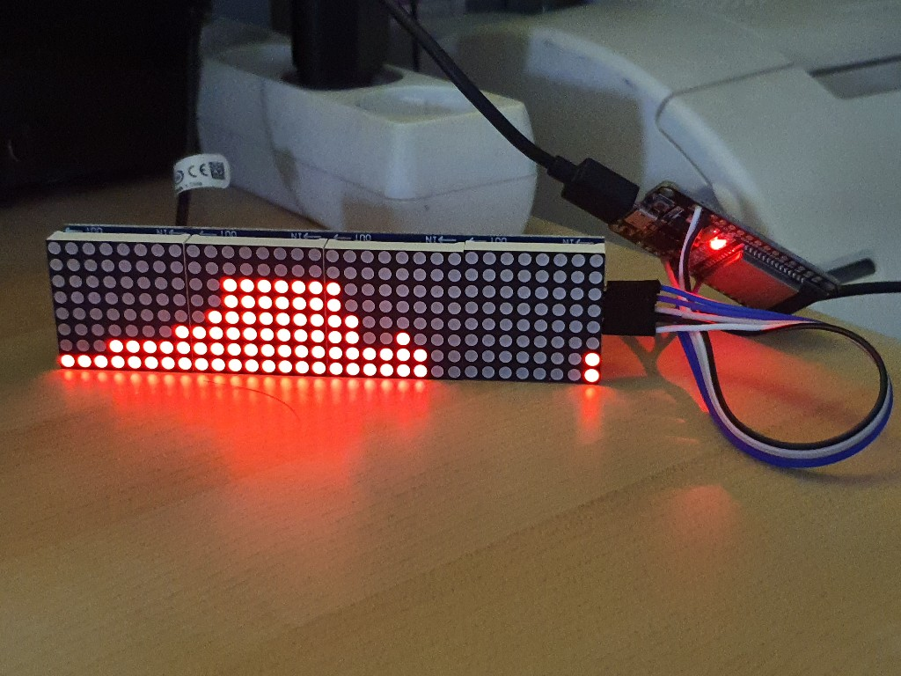

# rainradar
(in development)

Rain Radar (German: Regenradar)  displays the rain forecast  on a 32x8 led matrix.
It shows the intencity of the rain for the next 2 hours as LED bars one for every 5 minutes.

Picture of the current hardware implementation:

# common
The Rain Radar is a combination of:
- a ESP32 microcontroller
- a chain of four MAX7219 8x8 LED matrices
- an online service providing the rain radar in mm/h and weather forecast for geographic coordinates or postal index (https://morgenwirdes.de/api/) in Germany.

# setup
(draft)
- connect ESP32 and MAX7219 according to https://github.com/mcauser/micropython-max7219
- install Python on the PC
- flash the MicroPython image to the ESP32 as described in https://docs.micropython.org/en/latest/esp32/tutorial/intro.html
  - pip install esptool
  - esptool.py erase_flash
  - esptool.py  write_flash -z 0x1000  ~/Downloads/esp32/micropython/esp32-20210902-v1.17.bin
- install the tool to copy the files from to ESP32
  - pip install adafruit-ampy
  - ampy --port COM4 ls
- download the max7219.py module from  https://github.com/mcauser/micropython-max7219
- upload the max7219 module to the ESP32
  - ampy --port COM4 mkdir lib
  - ampy --port COM4 put ~/Downloads/esp32/micropython/max7219.py lib/max7219.py
  - ampy --port COM4 ls lib

