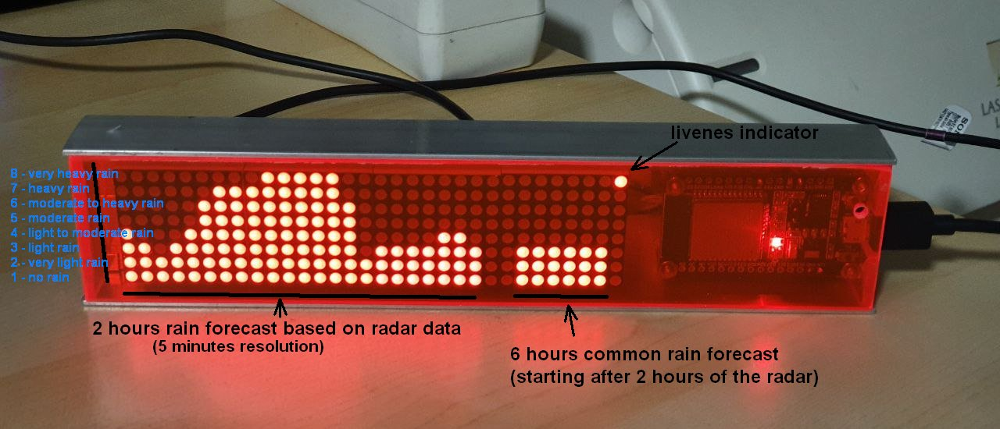
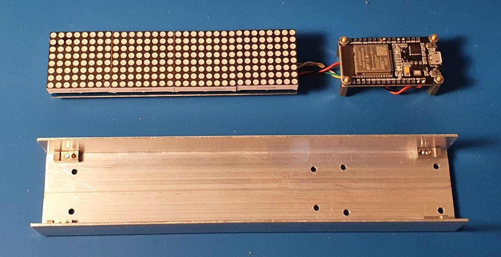
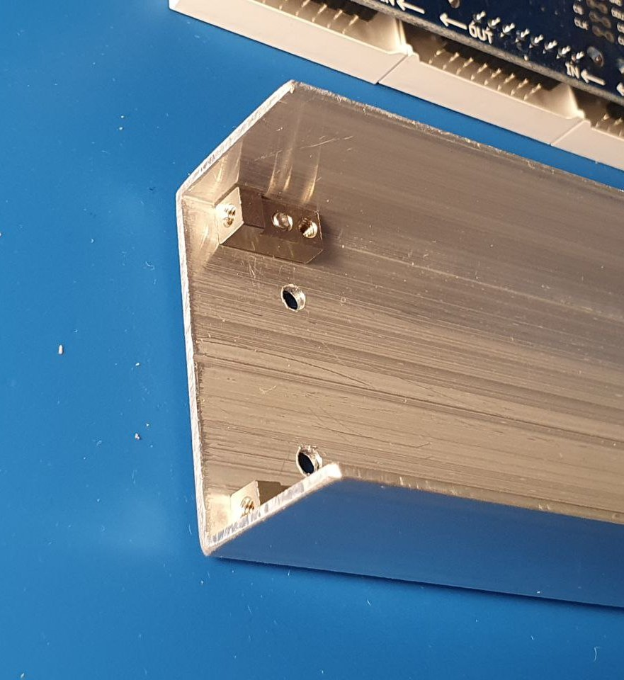
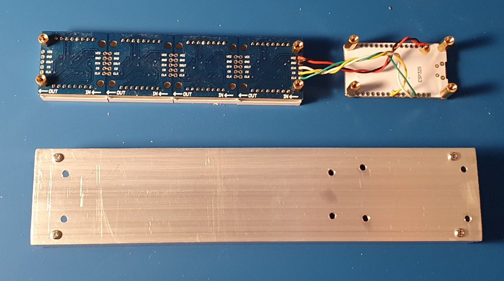
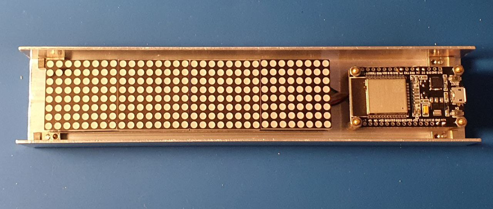
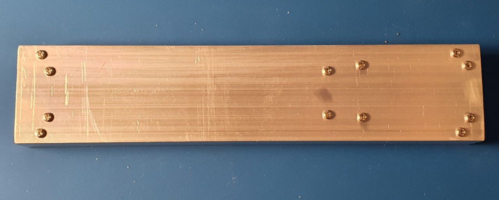
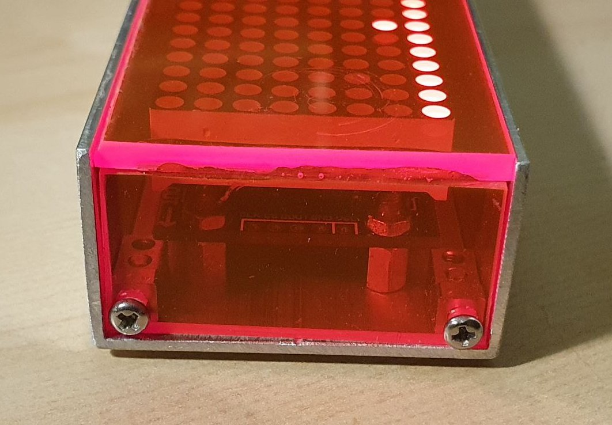
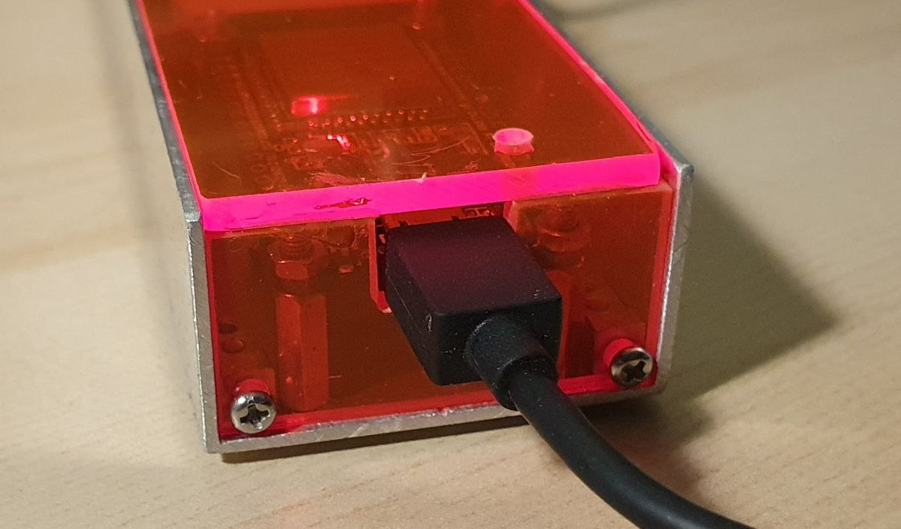

# rainradar
(in development)

Rain Radar (German: Regenradar)  displays the rain forecast  on a 32x8 led matrix.
It shows the intencity of the rain for the next 2 hours as LED bars one for every 5 minutes.

Picture of the current hardware implementation:

# common
The Rain Radar is a combination of:
- a ESP32 microcontroller
- a chain of four MAX7219 8x8 LED matrices
- an online service providing the rain radar in mm/h and weather forecast for geographic coordinates or postal index (https://morgenwirdes.de/api/) in Germany.

# manual

See the [User Manual](doc/manual/MANUAL.md)

# setup

- connect ESP32 to MAX7219 according to https://github.com/mcauser/micropython-max7219
- install Python on the PC
- flash the MicroPython image to the ESP32 as described in https://docs.micropython.org/en/latest/esp32/tutorial/intro.html
  - pip install esptool
  - esptool.py erase_flash
  - esptool.py  write_flash -z 0x1000  ~/Downloads/esp32/micropython/esp32-20210902-v1.17.bin
- install the tool to copy the files from to ESP32
  - pip install adafruit-ampy
  - ampy --port COM4 ls
- download the max7219.py module from  https://github.com/mcauser/micropython-max7219
- upload the max7219 module to the ESP32
  - ampy --port COM4 mkdir lib
  - ampy --port COM4 put ~/Downloads/esp32/micropython/max7219.py lib/max7219.py
  - ampy --port COM4 ls lib
- download the rainradar code from the ./rainradar directory of this project
- upload the rainradar code (i.e. the python modules *.py) to the ESP32
  - ampy --port COM4 put ~/Downloads/esp32/rainradar/rainradar/
  - ampy --port COM4 ls
- restart ESP32

# assembly
## Bill of material
- ESP32 dev board whith mounting holes
- Dot matrix module 4 8x8 with MAX7219 controller
- Aluminium U profile 23.5 x 43.5 mm (inside dimensions 20 x 40) cut to the length of 205 mm
- Acrylic glass plate, red transparent, cut to the pieces 
  - 40 x 205 for the top of the lid
  - 19 x 40 (2 pices) for the sides of the lid
- 4 x brass standoffs m2.5 12 mm height for the ESP32
- 4 x brass standoffs m2.5 6 mm height for the matrix module
- 4 x mounting blocks m2.5 [buerklin 17H9204](https://www.buerklin.com/en/Mounting-element/p/17H9204) for the lid
- Screws/nuts m2.5
## Blueprints
- [Drilling plan for the U profile](doc/case_drillings.scad). It can be opened in [OpenScad](https://openscad.org/) and the exported as [DXF file](https://en.wikipedia.org/wiki/AutoCAD_DXF) for measures and processing.
## Pictures of the assembly

