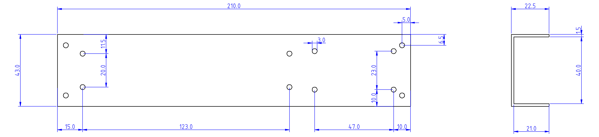
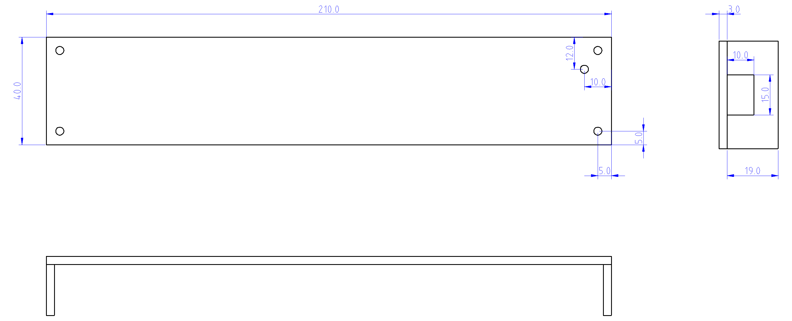

# Assembly of the Rain Radar

The assembly idea is based on the project from the German Make Magazine https://github.com/MakeMagazinDE/LED-Laufschrift

## Electronic

### Bill of Material

| No | Part Designation | Remark |
|----|------------------|--------|
| 1 | ESP32 Dev Kit Board | The variant with 4 mounting holes and without soldered headers |
| 2 | 34 x 8 LED Matrix MAX7219 | Actually it is assembly of 4x LED matrix modules sold soldered together |
| 3 | Tantal Elco 47 uF | Optional. Shall make the ESP32 working more reliable |
| 4 | Elco 1000 uF | Optional. Shall make the device working more reliable |
| 5 | 5 x single Socket to Socket Jumper Wire | Probably you will get some with the LED Matrix but some of different colors are preferable to avoid soldering errors |

### Schematic

### Soldering

1. Solder the 1000 uF Elco to the contacts VIN and GND of the ESP32
2. Solder the 476 uF Elco to the contacts 3V3 and GND of the ESP32
3. Remove the sockets from on side of the jumper wires so you can solder this side to the ESP32 and connect the remaining socket on the another side to the plug on the LED matrix
4. Solder the jumper wires to D2, D4 and D5 contacts of the ESP32
5. Solder 2 jumper wires directly to the legs of the 1000 uF Elco

### Connection

Connect the sockets of the soldered wires to the LED matrix according to the following table:

| ESP32 | LED Matrix |
|-------|------------|
| VIN |	VCC |
| GND |	GND |
| D2 | DIN |
| D4 | CLK |
| D5 | CS |

Remark: the table corresponds to the documentation from https://github.com/mcauser/micropython-max7219

## Encasing

### Bill of Material

| No | Part Designation | Remark |
|----|------------------|--------|
| 1 | Aluminum U profile 43.5 x 23.5 , 1.5mm thick | my was 1000mm long |
| 2 | Transparent acrylic glass plate 3mm thick | I used PLEXIGLAS® Cherry GS 3C01,  120 x 250 mm  |
| 3 | 8x 12mm m2.5 brass standoffs female-female | |
| 4 | 8x 6mm m2.5 brass standoffs female-male | |
| 5 | 20x m2.5 screws | |
| 6 | 4x m2.5 screw nuts | |
| 7 | 4x m2.5 washers 1mm thick | |

Remark: I bought all standoffs, screws, nuts, washer as a set on eBay.

### Aluminum Back

1. Cut the U profile to the length of 210 mm and sand the sharp edges
2. Drill the 3mm holes according to the plan. I used a drilling machine put into a drill stand for this.

### Acrylic lid

1. Cut the 40mm broad strip from the acrylic plate. I used the metal level ruler and the carpet knife for this.
2. Cut a piece of 210mm and 2 pieces of 19mm from the strip. I used the hacksaw for this.
3. Cut the USB socket opening in one of the short pieces. I used the fretsaw for this.
4. Drill the 5x 3mm holes according to the plan.
5. Stick the 3 pieces together according to the plan. I used the Super Glue.

### Put everything together 

For the idea of assembling everything together see the pictures below.

Just few remarks:
- The standoffs for the lid are build from the combination of:
  - 6mm standoff nut-screw
  - 1mm washer
  - 12mm standoff nut-nut
 
  to implement the length of the 19mm 
- The standoffs for the LED module are 6mm long. As the LED module is 13mm height this makes it fits perfectly under the lid. If you use a nut-screw standoff you will probably don't need to remove the 2 outside LED matrixes as you can just slide the nuts under them and screw them together with the standoff as seen on the picture below. On the same picture there are washers under the LED standoffs. This was made because for this rainradar exemplar I run out of the 6mm standoffs and used the 5mm version with the addition of the 1mm washer instead.

