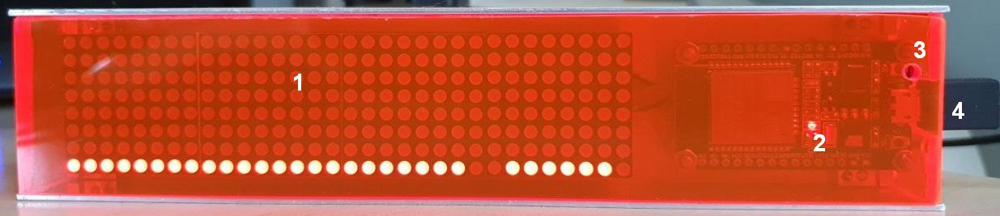
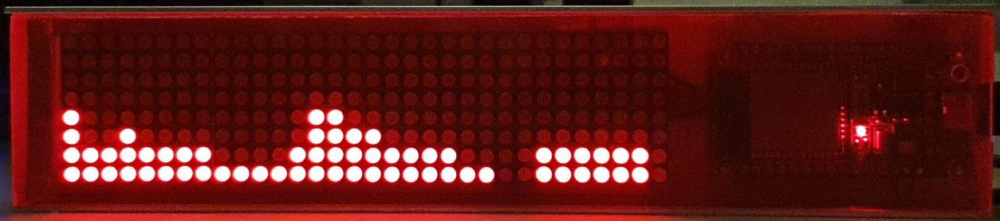
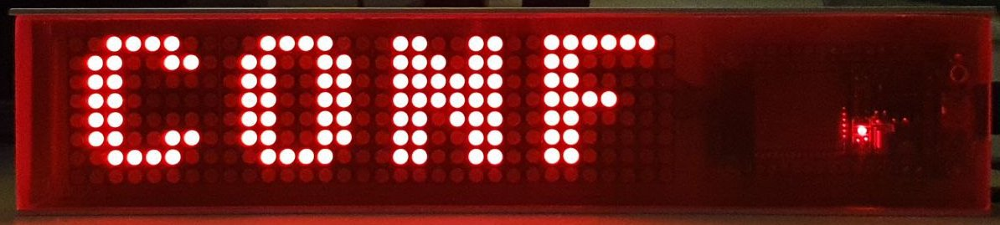
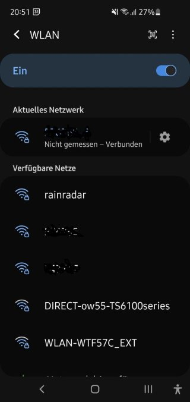
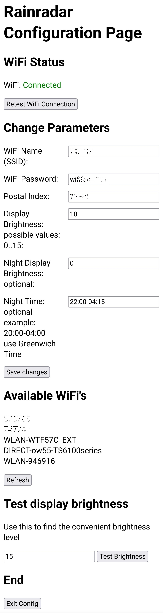

# Manual for the Rainradar

## Controls and Connectors

1. Display
2. Power LED
3. Configuration Mode Button
4. Micro USB Socket 

## Operational Mode

**For the initial configuration see:** [Configuration Mode](#configuration-mode)

In this mode the Rainradar displays the short term rain forecast in the left part of the display and middle term rain forecast in the right part.

The short term forecast shows the rain levels for the coming 2 hours with the resolution of 5 min.

The middle term forecast show the rain levels for the 6 hours after the 2 hours of the short term forecast. The resolution is 1 hour.

Additionally there is a blinking LED on the right edge of the display representing the liveness of the device. The distance of this LED to the upper corner of the display  represent the amount of time (in minutes) to the next refresh of the rain levels.

**Remark**
During the start (i.e. after powering of the Rainradar over the Micro USB connector) the Rainradar shows for some seconds the Postal Index it configured to provide the forecast for.

### Rain Levels

The rain levels are presented as a bar diagram. The height of the particular bar (i.e. the number of the shining LED's in the bar) visualizes the intensity of the rain in the corresponding time period.

The following table references the number of the LED's in the bar to the corresponding rain level:

| Number of the LED's | Rain Level in Text | Rain Level in mm/h |
|---------------------|--------------------|---------------------|
| 1 | No Rain | < 0.1 |
| 2 | Very Light Rain | 0.1 to 1.2 |
| 3 | Light Rain | 1.2 to 2.5 |
| 4 | Light to Moderate Rain | 2.5 to 5.5 |
| 5 | Moderate Rain | 5.5 to 10 |
| 6 | Moderate to Heavy Rain | 10 to 25 |
| 7 | Heavy Rain | 25 to 50 |
| 8 | Very Heavy Rain | from 50 |

### Example

This example represents the following situation:

**Short Therm Part on the Left**

- in the next 5 minutes there will be the light to moderate rain (the first bar with 4 LED's)
- after that there will be very light or light rain (the next 7 LED bars with 2 or 3 LED's in each) for 35 min (7 x 5 = 35)
- after that there will be no rain for 20 minutes (the 4 LED bars with only one LED in each)
- after that (so ca. after 1 hour from now) there will be light to moderate rain for ca. half of an hour which then will decline.

**Middle Therm Part on the Right**

For the time period starting with 3 to 8 hours from now there will be probably very light rain.

### Errors

In case of application errors during the Operational Mode they are shown for some seconds on the display. After that the application restarts.

The following table show know errors:

| Error on Display | Meaning | Possible Issue | Possible solution |
|------------------|---------|----------------|-------------------|
| **ERR WIFI** | The Rainradar could not connect to the WiFi network | No connection to the WiFi router | Fix the WiFi connection to the router, see [Configuration Mode](#configuration-mode) |
| **ERR NTP** | The Rainradar could not connect to the NTP server to synchronize its clock |  No connection to the internet | Fix connection to the internet in the WiFi router |
| **ERR GET RADAR** or **ERR GET RAIN**| The Rainradar could not get the weather information from the server. | No connection to the internet | see above |
|  |  | The server providing the radar information is broken/down | The Rainradar uses the [morgenwirdes](https://morgenwirdes.de/api/) server to get the information. Try to visit the site to get more information |
| **ERR JSON RADAR** or **ERR JSON RAIN**| The Rainradar could not parse the information provided by the server | The server providing the weather information is broken | see above |

In case you suspect the issues in the application itself you can raise an [issue ticket](https://github.com/dimitri-rebrikov/rainradar/issues)

## Configuration Mode

The configuration mode allows to change the parameters necessary for the [Operational Mode](#operational-mode):

- the credentials (SSID and password) of the WiFi network the Rainradar shall connect for
- the German postal index code (PLZ) the Rainradar shall provide the rain forecast for

During the initial start (i.e. if there is no configuration) the Rainradar will automatically switch into the Configuration Mode.

To switch into configuration mode any time later you shall press the configuration button through the hole in the lid. Please use a thin non-metal stick for this, for example a toothpick. The button will make a haptic noticeable click.

After switching into the Configuration Mode the Rainradar will show "CONF" on the display.

To configure the Rainradar you shall directly connect to it over direct WiFi connection.

### Connect to Rainradar over direct WiFi connection

In the Configuration Mode the Rainradar starts its own WiFi Access Point.
Open the WiFi configuration dialog in your device (PC, mobile phone etc) and search for  WiFi network with the name "rainradar".

Connect to this Access Point using the following password: *rainradar2021*

After successful connection you might get warning that there is no connection to the internet over this network. This is ok and by intention, as now you connected directly and exclusively only to the Rainradar.

Now open the address [http://192.168.4.1](http://192.168.4.1) in the Web Browser and the Rainradar configuration page shall be displayed.

### Configuration Page 

In the configuration page you shall provide the name and the password of the WiFi network the Rainradar shall use to connect to the internet. It is probably just the WiFi you use for your devices at home. 

The chapter "Available WiFi's" helps your with the names of the WiFi networks available.

Additionally you shall provide the German postal index (PLZ) of the location the Rainradar shall display the rain forecast for. It is probably just you postal index.

After your provided these 3 configuration parameters hit the "Save changes" button.

The Rainradar will try to connect to the WiFi and provide the result in the "WiFi Status" chapter. If the status is "Not connected" the issues might be the following:
| Issue | Solution |
|-------|----------|
| Wrong WiFi name or password | Correct the data and hit "Save changes" again |
| The WiFi network does not allow connection of the "unknown" devices | Configure your WiFi router accordingly. i.e. Either remove the protection or add the Rainradar to the list of the know devices. After that hit the "Retest WiFi Connection" button for a new try |
| The WiFi network signal is to weak | Search a location near to the WiFi router and hit the "Retest WiFi Connection" button for a new try |

**Attention:** there is no check for the right postal index so ensure you provided correct value. Otherwise the rain forecast will be wrong.

After successful configuration you can exit the config mode by hitting of the "Exit Config" button. The Rainradar will stop its Access Point, so the connection to the Rainradar will be lost and your device will probably automatically connect to your home network again.

The Rainradar will switch back into the [Operational Mode](#operational-mode)